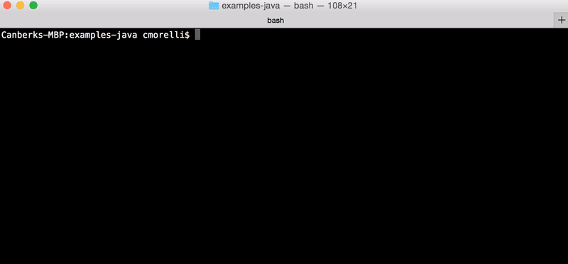
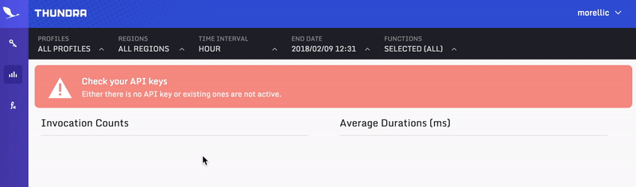
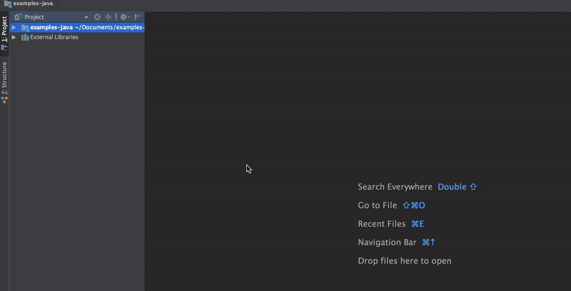
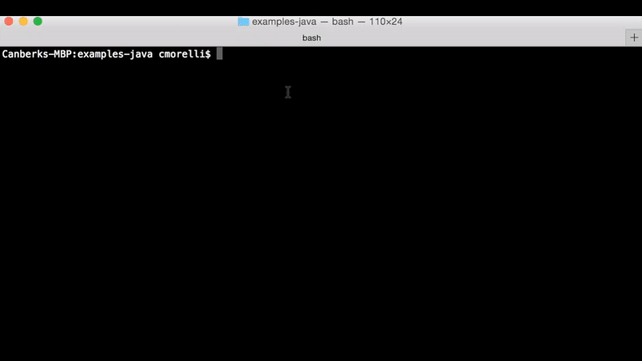
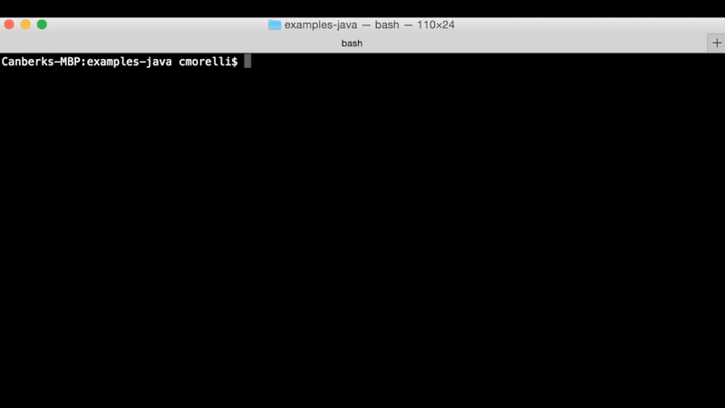
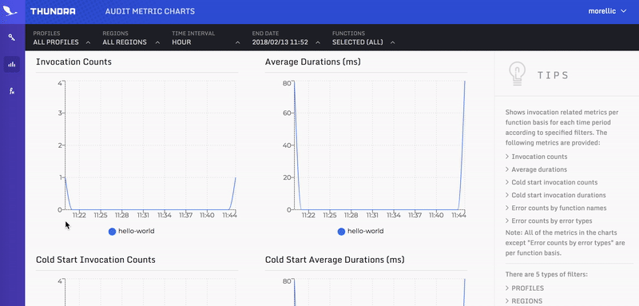

## Hello World
This is a simple example to get started with Thundra.

You will learn how to observe the invocation metrics of lambda functions on Thundra.

---

### How to run using [serverless](https://serverless.com/)


1 - **Install dependencies**, in repository directory:  

***Unix***:
```bash
./mvnw clean package
```
***Windows***:
```bash
mvnw.cmd clean install
```




2 - **Login** to [Thundra](https://beta.thundra.io/) to create your API key:



3 - **Configure `custom` field** in `examples-java/hello-world/serverless.yml`:

```
custom:
    deploymentBucket: <your-s3-deployment-bucket>
    thundraApiKey: <your-api-key>
    ...
```



4 - **Deploy**, in `examples-java/hello-world` directory:
```bash
sls deploy
```



5 - **Invoke**, in `examples-java/hello-world` directory:
```bash
sls invoke --function hello-world --data '{"msg":"Hello World!"}'
```



6 - **Enjoy your flight with** Thundra!

Visit [Thundra](https://beta.thundra.io/) to observe your metrics. It might take 1-2 minutes to be visible.


